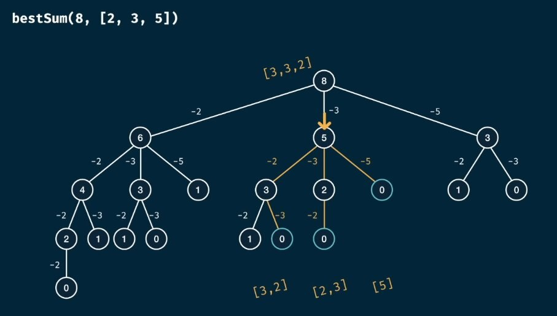
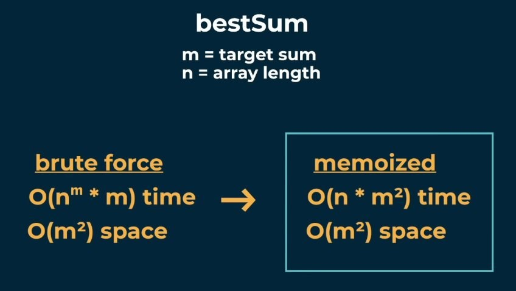

# Best sum problem

Write a function `bestSum(targetSum, numbers)` that takes in a
targetSum and an array of numbers as arguments.
The function should return an array containing the shortest
combination of numbers that add up to exactly the targetSum.
If there is a tie for the shortest combination, you may return any
one of the shortest.

Examples:
- bestSum(7, [5, 3, 4, 7]) -> [7]
- bestSum(8, [2, 3, 5]) -> [3, 5]
- bestSum(8, [1, 4, 5]) -> [4, 4]
- bestSum(100, [1, 2, 5, 25]) -> [25, 25, 25, 25]

Solution tree: 

Complexity: 

