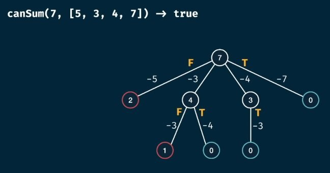
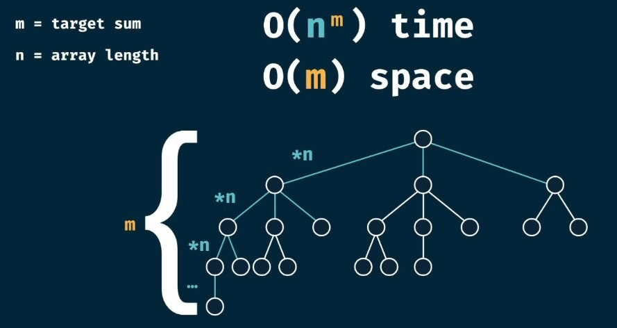

# Can sum problem 

Write a function `canSum(targetSum, numbers)` that takes in a
targetSum and an array of numbers as arguments.
The function should return a boolean indicating whether or not it
is possible to generate the targetSum using numbers from the array.

You may use an element of the array as many times as needed.
You may assume that all input numbers are nonegative.

Examples:
- canSum(7, [5, 3, 4, 7]) -> true
- canSum(7, [2, 4]) -> false
- canSum(7, [2, 3]) -> true
- canSum(8, [2, 3, 5]) -> true
- canSum(300, [7, 14]) -> false

Solution tree: 

Complexity: 

