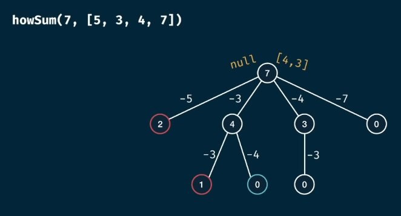
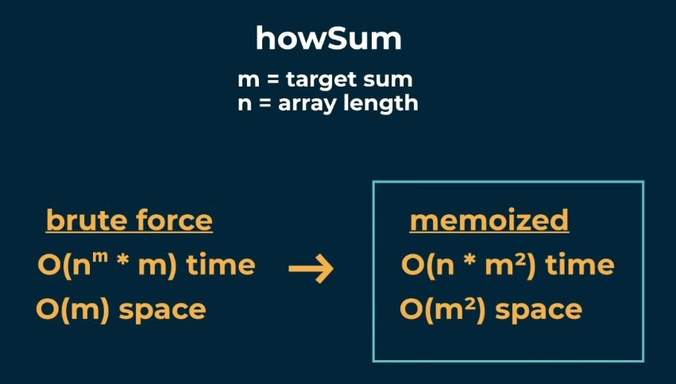

# How sum problem

Write a function `howSum(targetSum, numbers)` that takes in a
targetSum and an array of numbers as arguments.
The function should return an array containing any combination of
elements that add up to exactly the targetSum. If there is no
combination that adds up to the targetSum, then return null.
If there are multiple combinations possible, you may return any
single one.

Examples:
- howSum(7, [5, 3, 4, 7]) -> [3, 4] | [7]
- howSum(8, [2, 3, 5]) -> [2, 2, 2, 2] | [2, 3, 3] | [3, 5]
- howSum(7, [2, 4]) -> null
- howSum(0, [1, 2, 3]) -> []

Solution tree: 

Complexity: 

